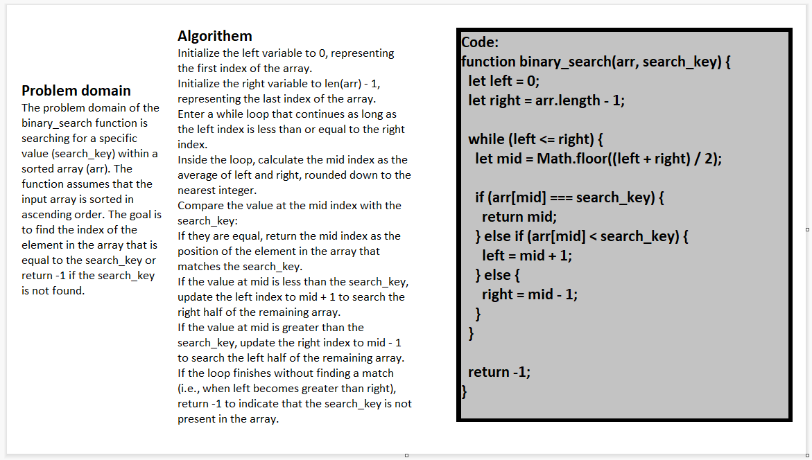

# Challenge Title: array-binary-search

## Description

This function  takes in two parameters: **arr**, *which is a sorted array*, and **search_key**, *which is the value we want to search for within the array*. `The goal is to find the index of the array element that is equal to the search_key`

## Whiteboard Process



## Approach & Efficiency

The iterative Binary Search approach divides the search space in half at each step, effectively reducing the search range by half in each iteration. By eliminating the non-target half of the array at each step, it quickly homes in on the desired element or determines its absence in the array. This approach has a time complexity of O(log n), where n is the size of the array, making it an efficient way to search for elements in a sorted array.

## Solution

```javascript

function binary_search(arr, search_key) {
  let left = 0;
  let right = arr.length - 1;

  while (left <= right) {
    let mid = Math.floor((left + right) / 2);

    if (arr[mid] === search_key) {
      return mid;
    } else if (arr[mid] < search_key) {
      left = mid + 1;
    } else {
      right = mid - 1;
    }
  }

  return -1;
}
