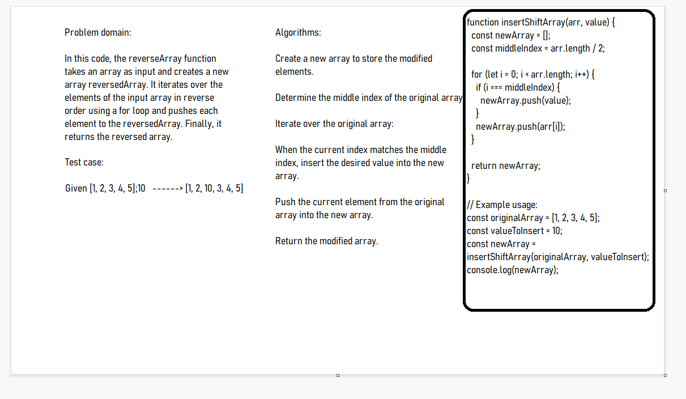

# Challenge Title: array-insert-shift

## Description

This function takes an array (arr) and a value (value) as input and returns a new array with the given value inserted in the middle of the original array. The function ensures that the existing elements in the array are shifted to accommodate the new value.

## Whiteboard Process



## Approach & Efficiency

This implementation has a time complexity of O(n), where n is the length of the input array, as it iterates over each element in the array once. The space complexity is O(n), as the modified elements are stored in a new array of the same length as the input array.

## Solution

```javascript

function insertShiftArray(arr, value) {
  const newArray = [];
  const middleIndex = arr.length / 2;

  for (let i = 0; i < arr.length; i++) {
    if (i === middleIndex) {
      newArray.push(value);
    }
    newArray.push(arr[i]);
  }

  return newArray;
}

// Example usage:
const originalArray = [1, 2, 3, 4, 5];
const valueToInsert = 10;
const newArray = insertShiftArray(originalArray, valueToInsert);
console.log(newArray);


```