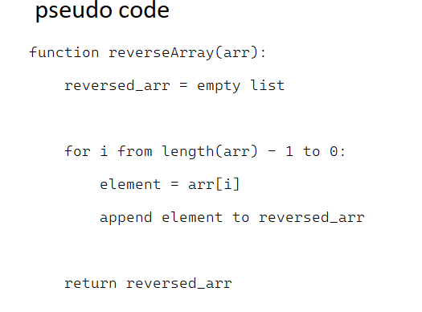

# Challenge Title: Reverse Array

## Description
The task is to write a function called reverseArray that takes an array as an argument and returns an array with elements in reversed order, without utilizing any of the built-in methods available in the language.

## Whiteboard Process


## Approach & Efficiency
1. Initialize an empty list called reversed_arr to store the reversed elements.
2. Iterate over the input array arr starting from the last index (length(arr) - 1) down to 0.
3. During each iteration:
   * Access the element at index i from arr and store it in a variable called element.
   * Append element to the reversed_arr.
4. Return the reversed_arr as the output.

## Solution

```javascript

function reverseArray(arr) {
  var reversed_arr = [];
  
  for (var i = arr.length - 1; i >= 0; i--) {
    var element = arr[i];
    reversed_arr.push(element);
  }
  
  return reversed_arr;
}

var myArray = [1, 2, 3, 4, 5];
var reversedArray = reverseArray(myArray);
console.log(reversedArray);

output: 
[5, 4, 3, 2, 1]

```