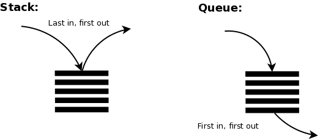

# stack and queue

## Stack:

A *stack* is a linear data structure that follows the Last-In-First-Out (LIFO) principle.
Elements are added and removed from the top of the stack.
The top of the stack represents the most recently added element.
Common operations on a stack include push (adds an element to the top), pop (removes the top element), and peek (returns the top element without removing it).
Stack implementation using a linked list involves maintaining a reference to the top node.
Stack is commonly used in algorithms involving backtracking, expression evaluation, and recursive function calls.

## Queue:

A *queue* is a linear data structure that follows the First-In-First-Out (FIFO) principle.
Elements are added to the rear (enqueue) and removed from the front (dequeue) of the queue.
The front of the queue represents the oldest element, while the rear represents the newest element.
Common operations on a queue include enqueue (adds an element to the rear), dequeue (removes the front element), and peek (returns the front element without removing it).
Queue implementation using a linked list involves maintaining references to the front and rear nodes.
Queue is commonly used in scenarios such as task scheduling, message passing, and breadth-first search algorithms.

`In summary, a stack and a queue are both fundamental data structures used for managing collections of elements. The main difference lies in the order of insertion and removal of elements. While a stack follows the LIFO principle, a queue follows the FIFO principle. Choosing between a stack or a queue depends on the specific requirements and behaviors of the problem or algorithm being solved.`