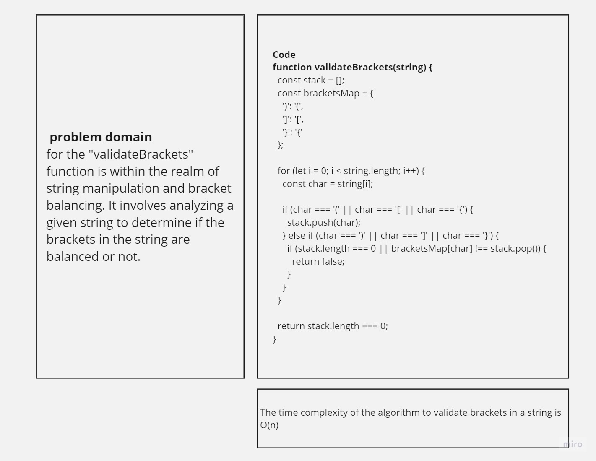

# stack-queue-brackets
The challenge is to implement a function called validateBrackets that checks whether the brackets in a given string are balanced or not. The function takes a single argument, which is the input string. It should return a boolean value indicating whether the brackets are balanced or not.

## Whiteboard Process

